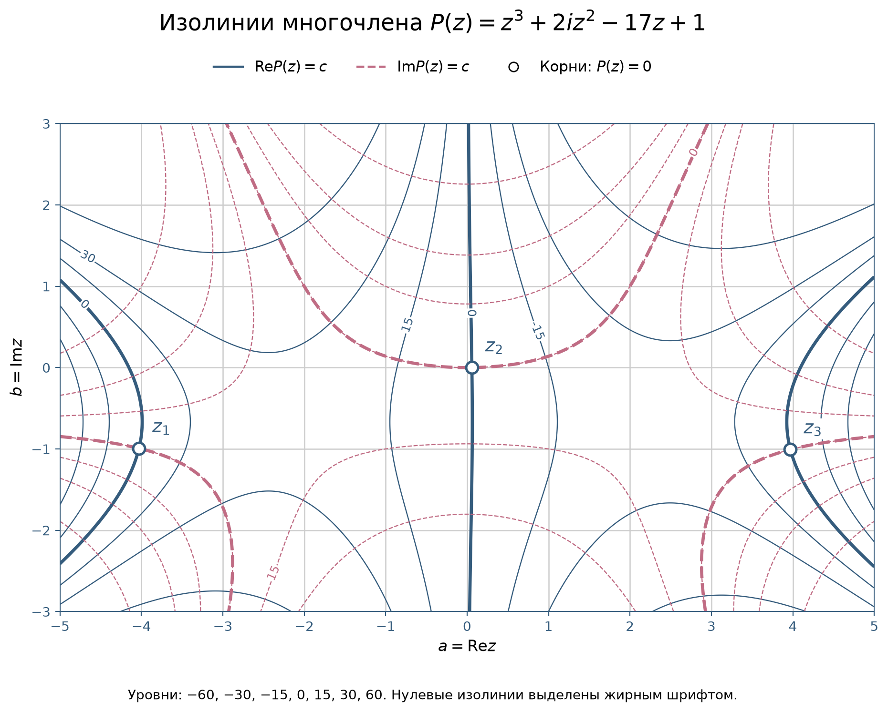

# Изолинии вещественной и мнимой частей многочлена

**Задача 1.3.** На комплексной плоскости построить изолинии вещественной и мнимой частей многочлена $P(z)=z^3+(i\cdot m)\cdot z^2-kz+1$. Область рисунка должна включать все три корня многочлена. Нужно описать метод построения.

Муравьёв Герман

### Решение

Рассмотрим многочлен:
$$
P(z)=z^3+(i\cdot m)\cdot z^2-kz+1,
$$

и выразим вещественную и мнимую части через координаты $a$ и $b$ числа $z=a+bi$. Затем вычислим корни, выберем прямоугольник и построим изолинии.

##### Находим вещественную и мнимую части

Пусть комплексное число вида $z=a+bi$, где $a,b\in\mathbb R$. Число $a$ называется вещественной частью, $b$ – мнимой частью. Введем специальный объект i, который будем называть мнимой единицей, для которого введем правило умножения: $i^2=-1$.

Для начала представим $z^3$ как произведение квадрата на комплексное число вида $z^3 = z^2 \cdot z$. По этой формуле ФСУ, разложим комплексное число, вида $z^2$:

$$
z^2=(a+bi)^2=a^2 +2abi - b^2.
$$

Умножим полученное выражение на z, комплексное число вида $z=a+bi$:

$$
\begin{aligned}
z^3&=(a^2 +2abi - b^2)(a+bi)\\
&=a^3-ab^2+(a^2b-b^3)i+2a^2bi-2ab^2\\
&= a^3-3ab^2+(3a^2b-b^3)i.
\end{aligned}
$$

Отдельно вычислим два остальных слагаемых:

$$
imz^2=im(a^2 +2abi - b^2)=-2mab+m(a^2-b^2)i,
$$

$$
-kz=-ka-kbi.
$$

Сложим вещественные и мнимые части по формуле сложения комплексных чисел:
$$
(a+bi)+(c+di) = (a+c) + (b + d)i
$$

имеем:

$$
P(a+bi)=\bigl(a^3-3ab^2-2mab-ka+1\bigr)
+i\bigl(3a^2b-b^3+m(a^2-b^2)-kb\bigr).
$$

Подставив постоянные: $m=2$, $k=17$ получаем:
$$
\begin{align*}
\operatorname{Re}P(a+bi)=a^3-3ab^2-4ab-17a+1, \\
\operatorname{Im}P(a+bi)=3a^2b-b^3+2a^2-2b^2-17b.
\end{align*}
$$

##### Проверка полученных формул

Вычислим $P(a+bi)$ непосредственно и сравним его части с полученными выражениями на сетке точек. Эта проверка контролирует реализацию формул в программе.

##### Записываем уравнения изолиний
Ранее мы нашли вещественную и мнимую части многочлена:
$$
\begin{align*}
\operatorname{Re}P(a+bi)=a^3-3ab^2-4ab-17a+1, \\
\operatorname{Im}P(a+bi)=3a^2b-b^3+2a^2-2b^2-17b.
\end{align*}
$$

Оба выражения зависят от двух переменных: $a$ и $b$. Подставляя их значения, получаем значение соответствующей части многочлена. Теперь нам нужно построить изолинии этих функций.

Запишем уравнения изолиний. Изолиния соединяет точки, в которых функция принимает одно и то же значение $c$. Для вещественной части нашего многочлена получаем:
$$
\operatorname{Re}P(a+bi)=a^3-3ab^2-4ab-17a+1=c,
$$
для мнимой части:
$$
\operatorname{Im}P(a+bi)=3a^2b-b^3+2a^2-2b^2-17b=c.
$$

Для пояснения возьмём простую функцию $f(x,y)=x^2+y^2$. Приравняем её к постоянному числу $c$: $x^2+y^2=c$. Получаем изолинию — точки, в которых значение функции одинаково и равно $c$. Далее подставим выражение функции в это равенство: $x^2+y^2=c.$ Здесь $c$ — это какое-то выбранное значение функции. Мы задаём это число и находим точки, в которых функция принимает именно такое значение. Для одной изолинии число $c$ остаётся неизменным.
Например, выберем $c=1$. Имеем: $x^2+y^2=1.$ Это окружность радиуса 1. Во всех её точках сумма $x^2+y^2$ равна одному и тому же числу – единице.

Для рисунка выберем несколько значений:
$$
c=-60,\;-30,\;-15,\;0,\;15,\;30,\;60.
$$

Отдельно выделим линии $\operatorname{Re}P(z)=0$ и $\operatorname{Im}P(z)=0$. В точке их пересечения обе части равны нулю, следовательно, $P(z)=0$. Поэтому такие пересечения дают корни многочлена.

##### Находим корни методом Ньютона
Чтобы выбрать область рисунка, найдём приближённые значения корней многочлена:
$$
z_{n+1}=z_n-\frac{f(z_n)}{f'(z_n)}.
$$

Предположим, что мы умеем вычислять функцию и её производную при любом заданном значении аргумента. Нужно найти её корень. Идея метода Ньютона: заменим функцию её линейным приближением в начальной точке.
$$
N(x)=f(x_1)+f'(x_1)(x-x_1).
$$

В нашем случае рассматривается многочлен $P(z)$. Обозначим начальное приближение через $z_1$. Тогда линейное приближение принимает вид:
$$
N(z)=P(z_1)+P'(z_1)(z-z_1).
$$

Найдем корень функции $N(z)$. Обозначим его через $z_2$. По определению корня, значение функции в этой точке равно нулю:
$$
N(z_2)=0.
$$

Подставим $z_2$ вместо переменной $z$ в выражение для $N(z)$. Получаем:
$$
N(z_2)=P(z_1)+P'(z_1)(z_2-z_1)=0.
$$

Перенесём первое слагаемое в правую часть:
$$
P'(z_1)(z_2-z_1)=-P(z_1).
$$

При $P'(z_1)\ne0$ разделим обе части на $P'(z_1)$:
$$
z_2-z_1=-\frac{P(z_1)}{P'(z_1)}, \quad z_2=z_1-\frac{P(z_1)}{P'(z_1)}
$$

При продолжении вычислений запишем:
$$
z_{n+1}=z_n-\frac{P(z_1)}{P'(z_1)}
$$

Вернёмся к нашему многочлену и возьмем производную:
$$
P(z)=3z^2+4iz-17.
$$

Далее подставим в метод Ньютона:
$$
z_{n+1}=z_n-
\frac{z_n^3+2iz_n^2-17z_n+1}
{3z_n^2+4iz_n-17}.
$$

Найдем приблеженное к корню число нашего многочлена, рассмотрим многочлен $P(z)=z^3+2iz^2-17z+1$, убрав при этом постоянную "единицу", имеем: $z^3+2iz^2-17z$. Вынесем общий множитель за скобки: $z(z^2+2iz-17)$. Произведение равно нулю, если хотя бы один из множителей равен нулю. Поэтому рассматриваем два случая: $z=0$ или $z^2+2iz-17=0$. Чтобы найти остальные корни этого вспомогательного уравнения, решаем второй случай. Учтём, что $(z+i)^2=z^2+2iz-1$, поэтому получаем: $(z+i)^2-16=0$, имеем: $(z+i)^2=16.$ Следовательно: $z+i=\pm4$, корни: $z=-4-i$ или $z=4-i.$ Таким образом мы имеем три числа: одно при котором $z=0$, $-4-i$, $4-i$.

Сначала возьмём $z_1=-4-i$. Подставим его в правую часть формулы:
$$
z_2=(-4-i)-
\frac{(-4-i)^3+2i(-4-i)^2-17(-4-i)+1}
{3(-4-i)^2+4i(-4-i)-17}.
$$

Сначала вычислим квадрат и куб числа. Учитываем, что $i^2=-1$:
$$
(-4-i)^2=16+8i+i^2=15+8i,
$$
$$
(-4-i)^3=(15+8i)(-4-i)=-60-15i-32i-8i^2=-52-47i.
$$

Теперь вычислим числитель:
$$
(-52-47i)+2i(15+8i)-17(-4-i)+1.
$$

Раскроем скобки:
$$
-52-47i+30i-16+68+17i+1.
$$

Соберём отдельно вещественные и мнимые части:
$$
(-52-16+68+1)+(-47+30+17)i=1.
$$

Далее вычислим знаменатель:
$$
3(15+8i)+4i(-4-i)-17.
$$

Раскроем скобки:
$$
45+24i-16i+4-17=32+8i.
$$

Подставим полученные значения:
$$
z_2=-4-i-\frac{1}{32+8i}.
$$

Чтобы выполнить деление, умножим числитель и знаменатель дроби на сопряжённое число \(32-8i\):
$$
\frac{1}{32+8i}
=
\frac{32-8i}{(32+8i)(32-8i)}
=
\frac{32-8i}{32^2+8^2}
=
\frac{32-8i}{1088}.
$$

Сократим дроби:
$$
\frac{1}{32+8i}=\frac{1}{34}-\frac{1}{136}i.
$$

Тогда
$$
z_2=-4-i-\left(\frac{1}{34}-\frac{1}{136}i\right).
$$

Раскроем скобки и приведём подобные:
$$
z_2=\left(-4-\frac{1}{34}\right)
+i\left(-1+\frac{1}{136}\right)
=-\frac{137}{34}-\frac{135}{136}i.
$$

Имеем:
$$
z_2\approx-4{,}029-0{,}99i.
$$

Далее повторим вычисления по той же формуле: подставим найденное $z_2$ и получим $z_3$, затем аналогично найдём $z_4$ и $z_5$

##### Полученные корни
Всякий многочлен $P_n(z)=a_0z^n+a_1z^{n-1}+\ldots+a_n$ может быть представлен в виде произведения: $P_n(z)=a_0(z-z_1)\cdots(z-z_n).$ Наш многочлен имеет третью степень, а его старший коэффициент равен 1. Поэтому: $P(z)=(z-z_1)(z-z_2)(z-z_3),$ где $z_1,z_2,z_3$ — корни многочлена с учётом кратности. Далее этими обозначениями будем обозначать корни, а не последовательные приближения метода Ньютона.

В результате вычислений получаем:
$$
\begin{aligned}
z_1&\approx-4{,}029148169-0{,}992844982i,\\
z_2&\approx0{,}058829865+0{,}000407400i,\\
z_3&\approx3{,}970318304-1{,}007562418i.
\end{aligned}
$$

Проверим полученные значения подстановкой в исходный многочлен. Используем числа, сохранённые в программе до округления. Для каждого получаем:
$$
|P(z_j)|<10^{-11},\qquad j=1,2,3.
$$

Таким образом, найдены три различных приближённых корня. Во всех трёх точках модуль значения многочлена меньше ограничения $10^{-11}$.

##### Выбираем область рисунка

Выберем прямоугольник

$$
-5\leq a\leq5,\qquad -3\leq b\leq3.
$$

Все три найденные точки находятся внутри него. Между крайними корнями и краями рисунка остаётся свободное место, поэтому видны не только корни, но и проходящие рядом изолинии.

##### Подготавливаем данные для построения

Разделим отрезок $[-5,5]$ на 1000 частей, а отрезок $[-3,3]$ — на 600 частей. В обоих направлениях шаг равен $0{,}01$. В каждой точке полученной сетки вычислим
$$
\begin{align*}
\operatorname{Re}P(a+bi)=a^3-3ab^2-4ab-17a+1, \\
\operatorname{Im}P(a+bi)=3a^2b-b^3+2a^2-2b^2-17b.
\end{align*}
$$

Для обоих используем уровни $-60,-30,-15,0,15,30,60$.

### Строим изолинии

Для $\operatorname{Re}P(a,b)$ используем бордовые сплошные линии, для $\operatorname{Im}P(a,b)$ — розово-красные пунктирные. Нулевые изолинии выделим толщиной. Корни отметим кружками и подпишем $z_1$, $z_2$, $z_3$. Масштаб по обеим осям одинаковый.

##### Комментарий к рисунку

На рисунке показаны две изолинии и все три найденных корня. В каждой отмеченной точке пересекаются нулевая изолиния вещественной части и нулевая изолиния мнимой части:

$$
\mathrm{Re}P(z_j)=0,\qquad \mathrm{Im}P(z_j)=0.
$$

Поэтому $P(z_j)=0$. Значения корней вычислены приближённо; выше приведены результаты проверки подстановкой. Корень $z_2$ на этом масштабе почти совпадает с вещественной осью, однако его мнимая часть составляет примерно $0{,}0004074$.
